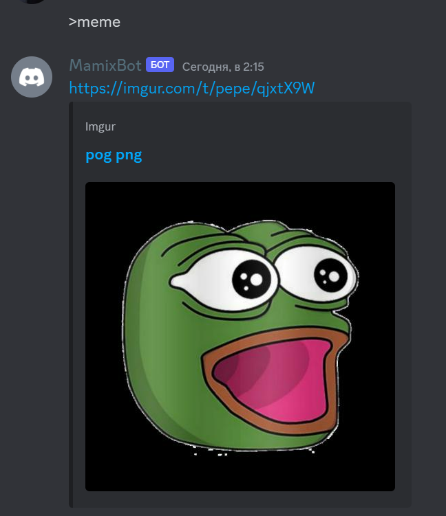
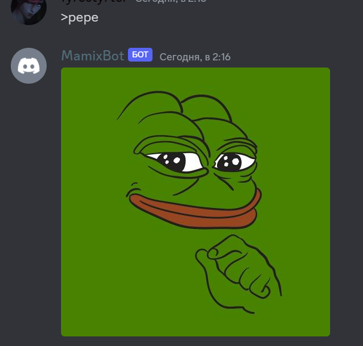
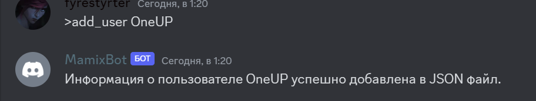
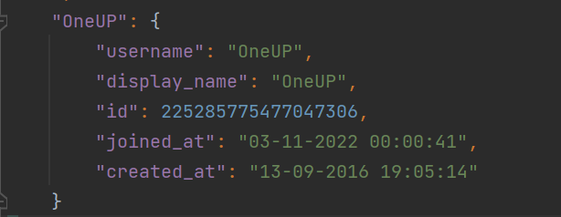

# disBot
Данный проект представляет собой бота для Discord написанного на Python c использованием библиотеки Discord.py

## List of commands and features
Бот поддерживает следующие команды и особенности:

- `>meme` - Присылает случайную картинку-мем
- `>pepe` - Присылает Лягушку Pepe
- `>add_user` - Добавляет данные о выбранном пользователей в JSON
- Возможность ставить реакцию на сообщение бота и получать за это роль на сервере
- Бот может отвечать на такие сообщения, как: "Привет","Пока","Помощь" и т.д.

## JSON 
Данные о пользователях хранятся в формате JSON. Пример записи данных выглядит так:

```json
"OneUP": {
        "username": "OneUP",
        "display_name": "OneUP",
        "id": 225285775477047306,
        "joined_at": "03-11-2022 00:00:41",
        "created_at": "13-09-2016 19:05:14"
    }
```
## Example
### >meme
Input: `>meme`

Output: 

### >pepe
Input: `>pepe`

Output: 

### >add_user
Input: `>add_user`

Output: 

